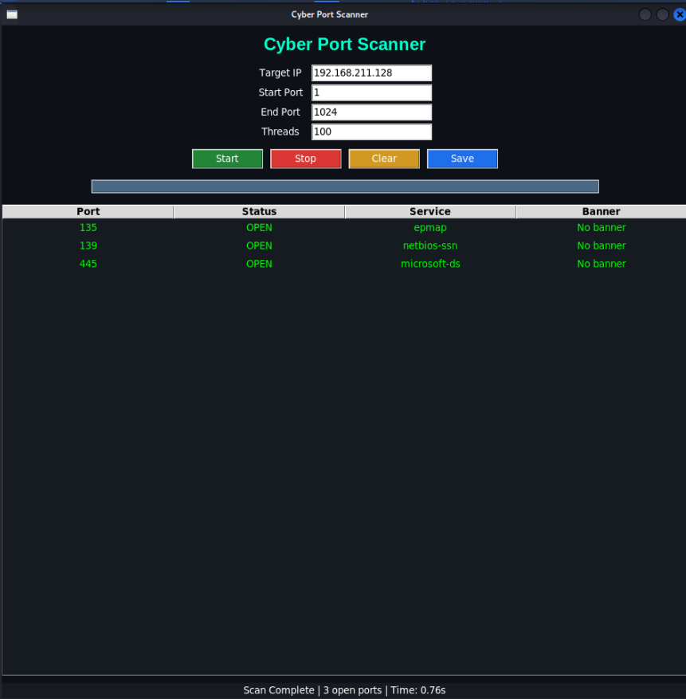

#  Cyber Port Scanner

Multi-threaded TCP port scanner with a Python GUI built using Tkinter. Demonstrates TCP/IP networking, port enumeration, service detection, and technical troubleshooting concepts.
---

## Features
- Fast multi-threaded scanning (configurable thread limit)
- Custom IP + port range
- Real-time results table
- Service detection (like Nmap)
- Banner grabbing
- CSV export
- Start / Stop / Clear controls
- Dark-themed UI

---

## Lab Setup
- Kali Linux (scanner)
- Windows 10 VM (target)
- VMware Workstation

---

## GUI Preview
<p align="center">
  
</p>

## Run

Clone the repository:

```bash
git clone https://github.com/lancasteralicia49-lgtm/cyber-port-scanner.git
cd cyber-port-scanner
python scanner_gui.py
```

Requirements:
- Python 3.x
- Tkinter
